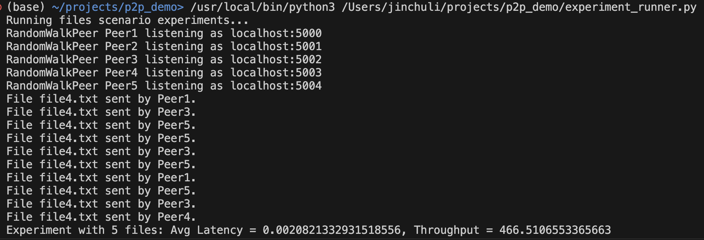
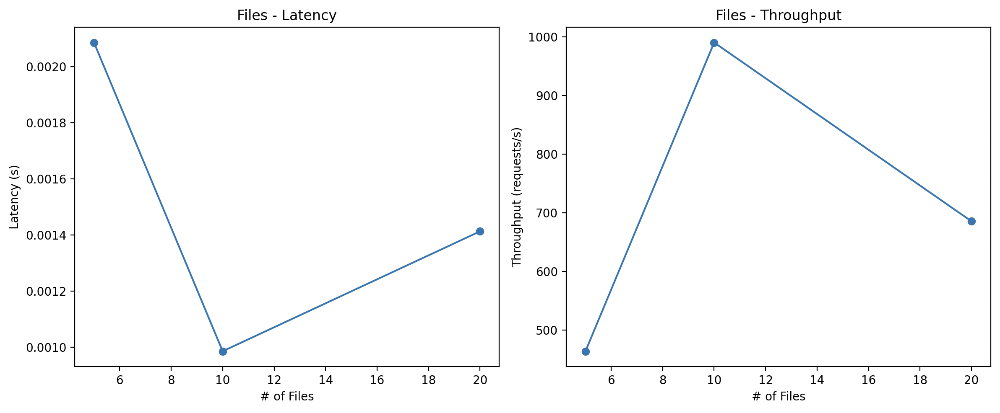
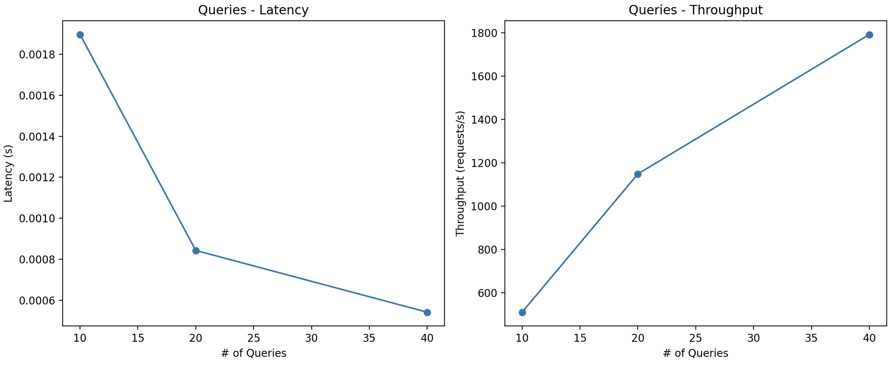
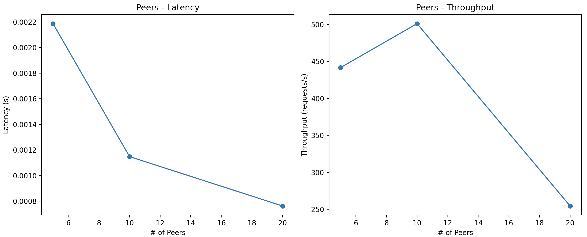
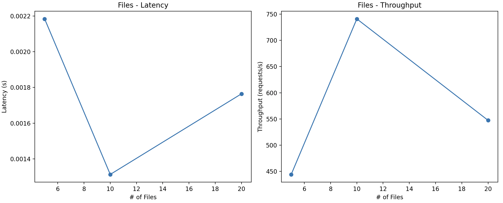
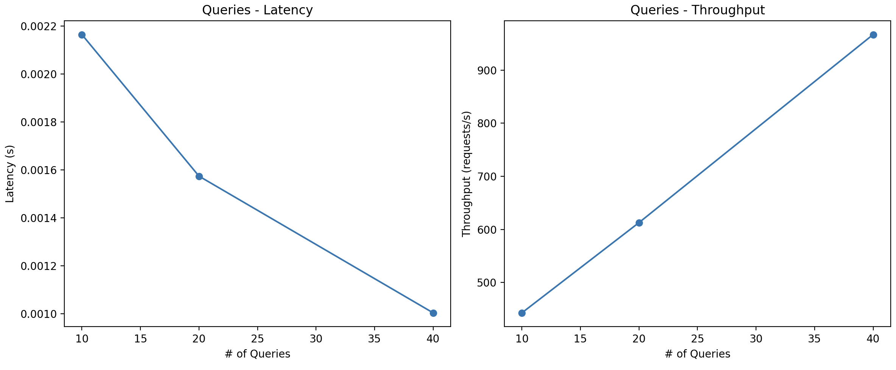

# CS6675 HW2

## Introduction

This is a demonstration project aimed at comparing the performance of two distinct routing strategies in peer-to-peer (P2P) networks: friend-based routing and random walk-based routing. This project implements a simplified P2P network model to explore how each routing method affects the efficiency, reliability, and scalability of data transmission among peers. 

## Usage
1. Toggle the `USE_RANDOM_WALK_ROUTING` flag in experiment_runner.py to switch between friend-based routing and random walk-based routing.
2. Run experiment_runner.py to execute the experiment and generate the results.
* Sample terminal output:
  

### Friend-based Routing
In friend-based routing, each peer maintains a list of friends and forwards messages to the friend that is closest to the destination.
#### Workload 1
This workflow uses 5, 10, and 20 files shared among 5 peers with a fixed number of test queries.

#### Workload 2
This workflow uses 10, 20, and 40 queries with a fixed number of shared files and peers.

#### Workload 3
This workflow uses 5, 10, and 20 peers with a fixed number of shared files and queries.

### Random Walk-based Routing
In random walk-based routing, each peer forwards messages to a random peer in the network.
#### Workload 1

#### Workload 2

#### Workload 3
As soon as the number of peers increases to 10, the program hangs and does not respond. Thus the graph is not available.

### Discussion
* Friend-based routing:
  * It seems to have a varied response as the # of files, queries, and peers increase. This could suggest that the routing strategy is sensitive to the network size and the amount of data being transmitted.
  * The primary benefit of such routing is that if friends are chosen wisely, the message will reach the destination in a small number of hops. Unfortunately, this demo wasn't able to demonstrate this.
  * Throughput performance shows a decline as both the number of files and peers increase, indicating potential scalability issues within larger networks or higher file counts. Friend-based routing, therefore, seems to be more suited for smaller networks where peers have direct or close connections, allowing for quicker searches and higher throughput within a controlled number of files and peers.
* Random walk-based routing:
  * As the number of files increases, latency also increases, which suggests that the process of randomly walking through the network becomes less efficient when more files are present. This is likely due to the increased number of hops required to randomly encounter the desired file. . This showcases that while random walk-based routing may be robust to network changes, its performance is sensitive to the scale of the network's content and the volume of requests being processed.
* Scalibility and reliability wise, friend-based routing struggles with larger networks, while random walk-based routing manages increased queries but falters with more peers, leading to system hangs. This does show that friend-based routing is more robust and reliable to scaling with peers.
* Anonymity in the system could be inherently higher in the random walk-based approach since the path a query takes is less predictable, making it more difficult to trace back to the originator. However, the friend-based protocol might compromise anonymity as it relies on predefined relationships, which could potentially expose the network's topology and the participants' interactions.

